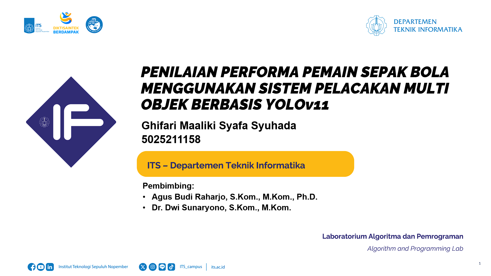

# 🏁 Tugas Akhir (TA) - Final Project

**Nama Mahasiswa**: Ghifari Maaliki Syafa Syuhada  
**NRP**: 5025211158  
**Judul TA**: PENILAIAN PERFORMA PEMAIN SEPAK BOLA MENGGUNAKAN SISTEM PELACAKAN MULTI OBJEK BERBASIS YOLOv11  
**Dosen Pembimbing**: Agus Budi Raharjo, S.Kom., M.Kom., Ph.D.  
**Dosen Ko-pembimbing**: 	Dr. Dwi Sunaryono, S.Kom., M.Kom.  

---

## 📺 Demo Aplikasi  

[](https://www.youtube.com/watch?v=QT_uBTFu9A4)  
*Klik gambar di atas untuk menonton demo*

---

## 🛠 Panduan Instalasi & Menjalankan Software  

### Prasyarat  
- Daftar dependensi:
  - Python 3.8

### Langkah-langkah  
1. **Clone Repository**  
   ```bash
   git clone https://github.com/Informatics-ITS/TA-gmaaliki.git
   ```
2. **Instalasi Dependensi**
   ```bash
   cd ta-gmaaliki
   pip install -r requirements.txt
   ```
3. **Input Data**
- Salin klip yang ingi di proses pada direktori `input_videos` dengan ekstensi `.mp4`, Contoh: `input_videos/dummy.mp4`
- Ubah variabel berikut pada `main.py`:
     -  `input_video` : jalur direktori klip yang ingin diproses
     -  `video_fps` : fps dari klip yang diproses 
4. **Jalankan Aplikasi**
   ```bash
   python main.py
   ```
5. Output dapat dilihat pada `output_videos` dengan nama direktory yang sama dengan nama klip. 

---


## ⁉️ Pertanyaan?

Hubungi:
- Penulis: 5025211158@student.its.ac.id
- Pembimbing Utama: agus.budi@its.ac.id
